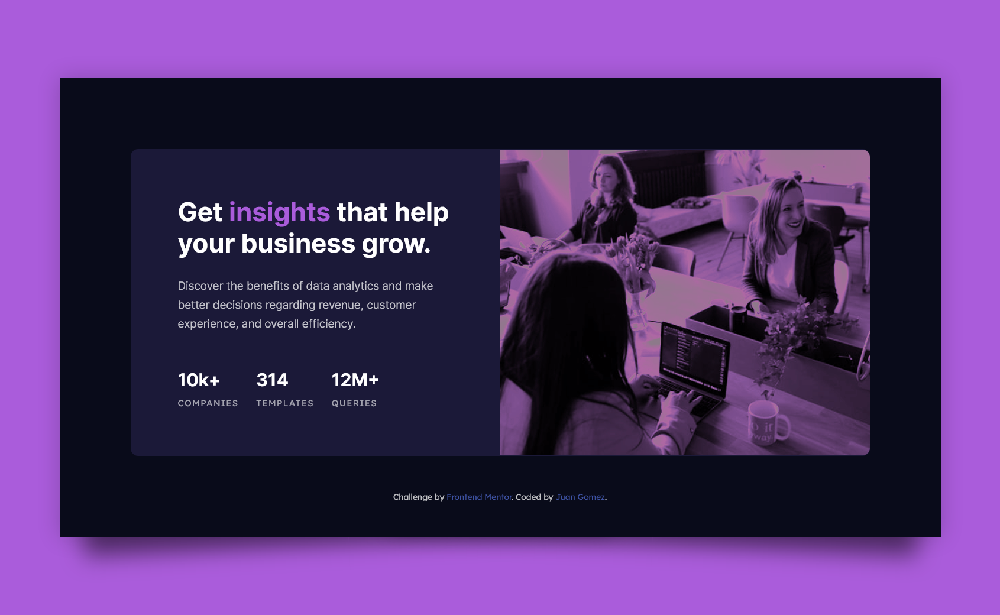
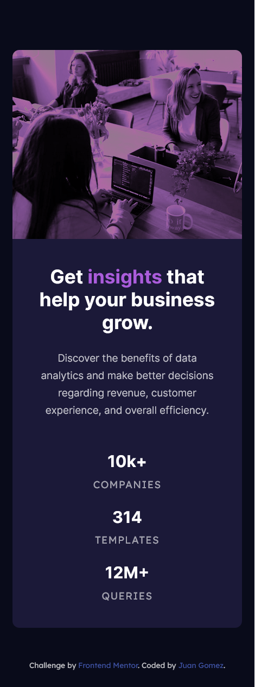

# Frontend Mentor - Stats preview card component solution

This is a solution to the [Stats preview card component challenge on Frontend Mentor](https://www.frontendmentor.io/challenges/stats-preview-card-component-8JqbgoU62). Frontend Mentor challenges help you improve your coding skills by building realistic projects. 

## Table of contents

- [Overview](#overview)
  - [Screenshot](#screenshot)
  - [Links](#links)
- [My process](#my-process)
  - [Built with](#built-with)
  - [What I learned](#what-i-learned)
  - [Continued development](#continued-development)
  - [Useful resources](#useful-resources)
- [Author](#author)
- [Acknowledgments](#acknowledgments)

## Overview

This is my solution to the Stat preview card component. I added a few extra
features to make the desktop version a little more pleasant.

### Screenshot




### Links

- Solution URL: [GitHub](https://github.com/newbpydev/04-stats-preview-card-component-main)
- Live Site URL: [Live Site](https://youthful-feynman-703bb0.netlify.app/)

## My process

### Built with

- Semantic HTML5 markup
- CSS custom properties
- Flexbox

### What I learned

I have learned on this project that it is easy to get lost on which layout would
be best to use, I have tried both flexbox and grid to see which would be easier
to maintain later on. I have also tried the mobile-first approach and work my
way to the desktop version.

```css
.main-content {
  display: flex;
  flex-direction: column;
  align-items: center;
  justify-content: center;

  min-width: max-content;
}
```

### Continued development

For future development, I will continue to train using the flexbox and combine
it with the grid.

### Useful resources

- [YouTube @media tutorial](https://www.youtube.com/watch?v=yyRtI1MIjhs&ab_channel=ThuNghiem) - This is an amazing article which helped me finally understanding the @media
  for mobile and the importance of creating a more responsive site.

## Author

- Website - [Juan Gomez](https://www.newbpydev.com)
- Frontend Mentor - [@newbpydev](https://www.frontendmentor.io/profile/newbpydev)
- Twitter - [@Newb_PyDev](https://twitter.com/Newb_PyDev)

## Acknowledgments

The code may not be perfect compared to my sensei @jonasschmedtman but I need
to thank him because he has shown me the ropes and now I am a confident web
designer.

